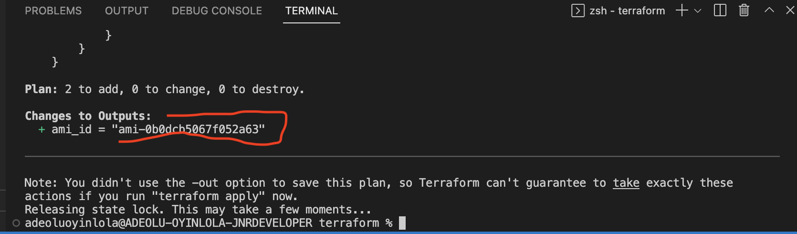

## Project Overview
* [IAC With Terraform](#iac-with-terraform)
  * [Authenticate to Provider(AWS)](#authenticate-to-provider)
  * [Provisioning Basic Infrastrucure](#provisioning-basic-infrastrucure)
  * [Creating EC2 Instance](#creating-ec2-instance)
* [Webserver With Nginx](#webserver-with-nginx)
  * [App Source Code](#app-source-code)
  * [SSH into the Server](#ssh-into-the-server)
  * [Install and Configure Nginx](#install-and-configure-nginx)
* [Containerize With Docker](#containerize-with-docker)

A simple wait list app developing with html, css and js. Part 1 cover how I provision infrastructure with Terraform, while Part 2 is about configuring nginx as webserver and Part 3 cover how I containarize the app with Docker
Here is the project file structure; 

## Hands-on
From the architecture flow shown;
Git --> GitHub --> GitHub Actions --> Build --> Push to DockerHub --> Terraform --> AWS Resources.

## IAC With Terraform
The architecture flow will be like this;
Create VPC --> Subnet --> Route Tables & Internet Gateway --> EC2 --> Deploy Docker container --> Security Group

### Authenticate to Provider(AWS)
- I created a file named ``main.tf`` which contain all the terraform configuration for this project.
- Using the IAM user role credentials created from AWS, given full AdminAccess, terraform authenticate into AWS and authorize to provision the above infrastructures.
- Remote backend; To use remote backend, I first ``terraform init`` and ``terraform apply`` inside the folder for local backend afterwhich I then rerun with remote backend. Below is my first lines of defination inside the `main.tf` file;

Then initialise with `terraform init` and `terraform apply`;

Switched to remote backend after adding the same to the file with `terraform init` and `terraform apply`;

Both S3 and DynamoDb table created, serving as container for storing remote backend; 

### Provisioning Basic Infrastrucure
- Worth of note that terraform is smart enough to create componemt accrodingly even when the defination is out of order/sequence. Here, I create VPC, Subnet, Security group, Availability Zone, Route table.
- Variable; I set separate list of variables for AZ as a set, name tag for every component created I give it a prefix of environment that will be deploy in(using variable inside string).
- Trying to check if this config working, first deploy VPC and subnet;

And the subnet;

- Created route table, Subnet association with route table.
- Security group; I configure firewall rules of the EC2 instance, where I just expose port 22 for ssh, tcp at 8080 and outbound rule at any.

### Creating EC2 Instance
- The most required arguments are AMI value and the Instance type. However, I set other arguments so that the EC2 share the security group and ends up in the subnet created inside the VPC above.
- I choose Amazon Machine Image of Linux distribution, dynamically using its AMI ID value in the desire region all defined in the data block, check image below;

When checked to know if it same with desire AMI, output on the terminal before actual deployment;

- I variable for the instance type to t2.micro 
- Also create a key-pair to access the instance once set up. The key private (.pem file) get downloaded into Download directory, the move the .pem file to usr .ssh folder, from terminal run the commands; ``mv ~/Downloads/tf-server-key.pem ~/.ssh``

Move it to user profile

- Also, as AWS requirement I further to make it secure by setting its permission with chmod command. ``chmod 400 ~/.ssh/tf-server-key.pem``
- I was able to ssh into the new instance created;

- Automate the ssh; set variable for the key-pair
Getting the public from the .ssh/ folder. And reference the file location.
- Finally, I ran ``terraform plan`` and ``terraform apply --auto-approve``

## Webserver With Nginx
- Note that the same and following configuration can be achieve through `file` concept in terraform. I will just run all the commands in each line as I will on the shell. But for the sake of exploring alternative, will manually run all the commands direct inside the instance created. Also the last part will cover how I use GitHub Action to Dockerize the same app.

### App Source Code
I created a folder ``app-nginx`` which contains static files;
1.) index.html - UI/frontend
2.) scripts.js - the logic
3.) assets folder - holding pictures assets

### SSH into the Server
- SSH into the linux server previously provision with terraform above by running the command; ``ssh -i <ssh-downloaded-path> ec2-user@<ip-address>``

### Install and Configure Nginx
- Install Nginx; First, update the instance with ``sudo yum update`` Display should be similar to this;

Then follow with nginx install; ``sudo amazon-linux-extras install nginx1``

- Adjust Firewall; to enable firewall, run ``sudo ufw enable``

- Check the server

- Manage the Nginx Process

## Containerize With Docker

I will be using Docker-compose to run this app and other third-party(MongoDB and Mongo-Express for data persistence) services. From ``https://hub.docker.com`` I checked the doc for the right use of MongoDB and Mongo-Express image and its environment varibale configuration. The resulting configuration for the yaml file is saved with named ``docker-compose.yaml`` as part of application code.
NOTE; In production scale, all the environment variable need to be well secured, and defined externally not as I expose it here.

### Build Image with Dockerfile
Here, I define Dockerfile as the blueprint for building the image, which contain a copy of the application source code and its dependencies. Following is what I expected if I start a container from this image; I based the image on ``node:13-alpine`` image so all execution follow Linux command, define env internally, create a /home/app directory, from the host machine copy the current folder files to /home/app, I then start the app with ``node server.js`` - the entrypoint command. I commited this file to my remote repo at the root as can be seen from the file structure.