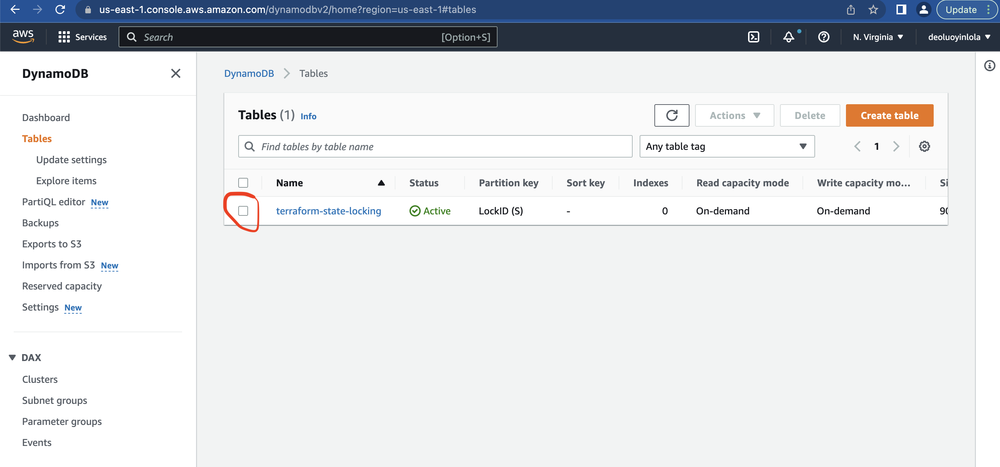

Here is the documentation that demostrate how I carried out this project;

## Project Overview
The flow will follow the same architecture below;

* [Continous Integration](#continous-integration)
  * [App Source Code](#app-source-code)
  * [Multiple Services with Docker-compose](#multiple-services-with-docker-compose)
  * [Build Image with Dockerfile](#build-image-with-dockerfile)
  * [Pipeline with GitHub Actions](#pipeline-with-github-aactions)
  * [Check with DockerHub](#check-with-dockerhub)
* [IAC With Terraform](#iac-with-terraform)

## Hands-on
From the architecture flow shown above;
Git --> GitHub --> GitHub Actions --> Build --> Push to DockerHub --> Terraform --> AWS Resources.
## Continous Integration
A simple profile app developing with Nodejs and MongoDB & Mongo-Express for handling data persistence. I choose Docker-compose to run these services, while build the image with GitHub Actions and get push to DockerHub.
Here is the project file structure; 

### App Source Code
I am using HTML and JS for the Frontend and Nodejs for the Backend, listening at port 3000. Mongo-Express make it easier for me working with MongoDB instead of using CLI, listening it at port 8081.
I created a folder ``app`` which contains static files;
1.) index.html - UI/frontend
2.) server.js - backend
3.) images folder - holding my pictures assets
NOTE; node_modules, package-lock.json and package.json are auto generated at the instance of installing npm for dependencies. While docker-compose.yaml is created at docker-compose session and .dockerignore created to basically ignore node_modules been commited to remote repo.

### Multiple Services with Docker-compose
I will be using Docker-compose to run this app and other third-party(MongoDB and Mongo-Express for data persistence) services. From ``https://hub.docker.com`` I checked the doc for the right use of MongoDB and Mongo-Express image and its environment varibale configuration. The resulting configuration for the yaml file is saved with named ``docker-compose.yaml`` as part of application code.
NOTE; In production scale, all the environment variable need to be well secured, and defined externally not as I expose it here.

### Build Image with Dockerfile
Here, I define Dockerfile as the blueprint for building the image, which contain a copy of the application source code and its dependencies. Following is what I expected if I start a container from this image; I based the image on ``node:13-alpine`` image so all execution follow Linux command, define env internally, create a /home/app directory, from the host machine copy the current folder files to /home/app, I then start the app with ``node server.js`` - the entrypoint command. I commited this file to my remote repo at the root as can be seen from the file structure.

### Pipeline with GitHub Actions

## IAC With Terraform
The architecture flow will be like this;
Create VPC --> Subnet --> Route Tables & Internet Gateway --> EC2 --> Deploy Docker container --> Security Group

### Authenticate to Provider(AWS)
- I created a file named ``main.tf`` which contain all the terraform configuration for this project.
- Using the I AM user role credentials created from AWS, terraform authenticate into AWS and authorize to provision the above infrastructures.
- Remote backend; To use remote backend, I first ``terraform init`` and ``terraform apply`` inside the folder for local backend afterwhich I then rerun with remote backend. Below is my first lines of defination inside the `main.tf` file;

Then initialise with `terraform init` and `terraform apply`;

Switched to remote backend after adding the same to the file with `terraform init` and `terraform apply`;

Both S3 and DynamoDb table created, serving as container for storing remote backend; 

 

 variable vpc_cidr_block {}
variable subnet_1_cidr_block {}
variable avail_zone {}
variable env_prefix {}
variable instance_type {}
variable ssh_key {}
variable my_ip {}

data "aws_ami" "amazon-linux-image" {
  most_recent = true
  owners      = ["amazon"]

  filter {
    name   = "name"
    values = ["amzn2-ami-hvm-*-x86_64-gp2"]
  }

  filter {
    name   = "virtualization-type"
    values = ["hvm"]
  }
}

output "ami_id" {
  value = data.aws_ami.amazon-linux-image.id
}

resource "aws_vpc" "myapp-vpc" {
  cidr_block = var.vpc_cidr_block
  tags = {
      Name = "${var.env_prefix}-vpc"
  }
}

resource "aws_subnet" "myapp-subnet-1" {
  vpc_id = aws_vpc.myapp-vpc.id
  cidr_block = var.subnet_1_cidr_block
  availability_zone = var.avail_zone
  tags = {
      Name = "${var.env_prefix}-subnet-1"
  }
}

resource "aws_security_group" "myapp-sg" {
  name   = "myapp-sg"
  vpc_id = aws_vpc.myapp-vpc.id

  ingress {
    from_port   = 22
    to_port     = 22
    protocol    = "tcp"
    cidr_blocks = [var.my_ip]
  }

  ingress {
    from_port   = 8080
    to_port     = 8080
    protocol    = "tcp"
    cidr_blocks = ["0.0.0.0/0"]
  }

  egress {
    from_port       = 0
    to_port         = 0
    protocol        = "-1"
    cidr_blocks     = ["0.0.0.0/0"]
    prefix_list_ids = []
  }

  tags = {
    Name = "${var.env_prefix}-sg"
  }
}

resource "aws_internet_gateway" "myapp-igw" {
	vpc_id = aws_vpc.myapp-vpc.id
    
    tags = {
     Name = "${var.env_prefix}-internet-gateway"
   }
}

resource "aws_route_table" "myapp-route-table" {
   vpc_id = aws_vpc.myapp-vpc.id

   route {
     cidr_block = "0.0.0.0/0"
     gateway_id = aws_internet_gateway.myapp-igw.id
   }

   # default route, mapping VPC CIDR block to "local", created implicitly and cannot be specified.

   tags = {
     Name = "${var.env_prefix}-route-table"
   }
 }

# Associate subnet with Route Table
resource "aws_route_table_association" "a-rtb-subnet" {
  subnet_id      = aws_subnet.myapp-subnet-1.id
  route_table_id = aws_route_table.myapp-route-table.id
}

resource "aws_key_pair" "ssh-key" {
  key_name   = "myapp-key"
  public_key = file(var.ssh_key)
}

output "server-ip" {
    value = aws_instance.myapp-server.public_ip
}

resource "aws_instance" "myapp-server" {
  ami                         = data.aws_ami.amazon-linux-image.id
  instance_type               = var.instance_type
  key_name                    = "myapp-key"
  associate_public_ip_address = true
  subnet_id                   = aws_subnet.myapp-subnet-1.id
  vpc_security_group_ids      = [aws_security_group.myapp-sg.id]
  availability_zone			      = var.avail_zone

  tags = {
    Name = "${var.env_prefix}-server"
  }

  user_data = <<EOF
                 #!/bin/bash
                 apt-get update && apt-get install -y docker-ce
                 systemctl start docker
                 usermod -aG docker ec2-user
                 docker run -p 8080:8080 nginx
              EOF
}

resource "aws_instance" "myapp-server-two" {
  ami                         = data.aws_ami.amazon-linux-image.id
  instance_type               = var.instance_type
  key_name                    = "myapp-key"
  associate_public_ip_address = true
  subnet_id                   = aws_subnet.myapp-subnet-1.id
  vpc_security_group_ids      = [aws_security_group.myapp-sg.id]
  availability_zone			      = var.avail_zone

  tags = {
    Name = "${var.env_prefix}-server-two"
  }

  user_data = <<EOF
                 #!/bin/bash
                 apt-get update && apt-get install -y docker-ce
                 systemctl start docker
                 usermod -aG docker ec2-user
                 docker run -p 8080:8080 nginx
              EOF
}